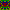
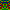

image-generation
================

Usage
-----
This application creates Random Symmetric 10x10 PNGs like this: 

Installation
------------
1. `go get github.com/AureumApes/image-generation` - Download the Code
2. `go install github.com/AureumApes/image-generation` - Build the Code to $GOPATH/bin
3. `image-generation` - The binary needs to be in a $PATH folder for this to work